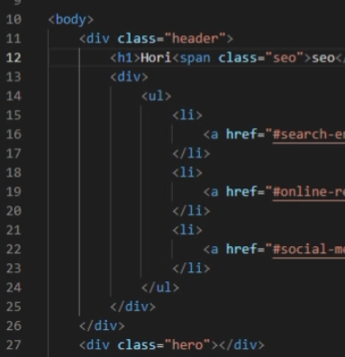
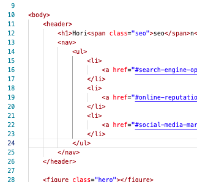

#   horiseon-codeRefactoring

##  Description
This application was originally created as a social media marketing site. I took this repository and went through the HTML code to clean it up and use semantic elements. After cleaning up the HTML elements, I did the same with CCS and added comments for others to better understand. Some of the challenges were taking the initial code and making sure that the changes I made did not effect the expected outcome. In the future, I hope that by organizing the code, others can go in as needed and spruce up the site more efficiently. 

[Deployable Link](https://chelseaburnham.github.io/horiseon-codeRefactoring/)

##  Installation
To install this project, fork the repository to your Github account.  
Once on your Github account, clone the repository to your local machine. 

##  Usage
Suitable for learning how to organize HTML using semantic elements. See screenshot below: 

##  Credits
[w3schools](https://www.w3schools.com/) 
[Stack Overflow](https://stackoverflow.com/?newreg=8cd9776f072c449eac02d1ab363597c8)

##  License
[MIT License](https://github.com/chelseaburnham/horiseon-codeRefactoring/blob/368d1a93be29a4acbbc7c928712fab12287fda85/LICENSE)